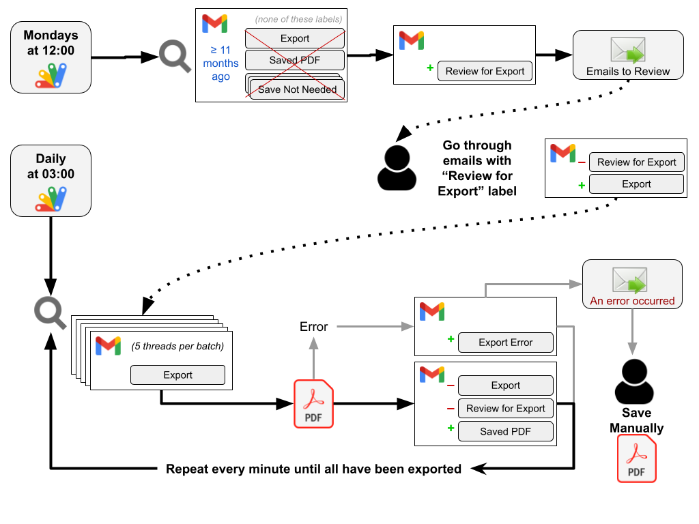
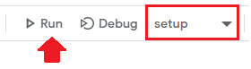

# Gmail to PDF Script

## Description
This script will check weekly for emails that will be deleted soon (from 11+ months ago) and will add a label to them so you can determine if they should be exported.  It will send an email to you if it finds emails matching this criteria as a reminder to mark them for export if needed.  It will exclude anything that has already been marked for export, has been exported, or labeled “save not needed.” You can also exclude any other labels you use on emails never needing to be exported.

The second scheduled action is to export emails daily.  It will check for emails with the “Export” label and start exporting them in batches of 5, repeating this every minute until done.  After exporting an email thread, it will remove the “Export” label and add a “Saved PDF” label. It will also save attachments as separate files.  If an error is encountered when exporting emails, you’ll receive an email with a link to the thread that failed, which you can print to “Save to Google Drive.” This sometimes happens with really long email threads (e.g. 300 pages when exported).

## Installation

1. Before starting, consider what labels you are currently using that should not be exported and don’t need review.  These will be included in the “excludeLabels” variable.
1. Open a new tab and enter  script.new  into the address bar.
1. Click **Untitled Project** and give your script a name (e.g., “GmailToPdf”)
1. Delete everything from the code area (myFunction…) and copy/paste all the code from [this file](Code.gs).
1. _(Optional)_ Change any of the variables at the top of the script if desired. **Note**, if you change any of these after initial setup, run the “setup” function again to apply the changes.
1. Ctrl-S or click the Save button
1. To get the script started, change the drop-down to “setup” and click Run, which will save your variables and set up the daily and weekly triggers. 

   - This will also create your `Export` label if you haven’t already done so.
   - The first time you run the script, you will have to grant it permission to access your email and files.

### Variables
<table>
  <tr><th>Variable</th><th>Default</th><th>Description</th></tr>
  <tr>
    <td><code>exportLabel</code></td>
    <td><code>“Export”</code></td>
    <td>Label you’ll put on email threads you want to export. Will be created by <code>setup</code> script if it doesn’t already exist.</td>
  </tr>
  <tr>
    <td><code>doneLabel</code></td>
    <td><code>“Saved PDF”</code></td>
    <td>Label to add after export is complete. Will be created when exporting emails if it doesn’t already exist. </td>
  </tr>
  <tr>
    <td><code>errorLabel</code></td>
    <td><code>"Export Error"</code></td>
    <td>Label to add if there’s an error when exporting. Will be created if an error is encountered, if it doesn’t already exist.</td>
  </tr>
  <tr>
    <td><code>reviewLabel</code></td>
    <td><code>“Review for Export”</code></td>
    <td>Label to add to emails that will be deleted soon. Will be created by the review script if it doesn’t already exist.</td>
  </tr>
  <tr>
    <td><code>driveFolder</code></td>
    <td><code>“Gmail Archive”</code></td>
    <td>Folder in your Google Drive where you want to save exported emails. Folder will be created if it doesn’t already exist (in the root of your Drive).</td>
  </tr>
  <tr>
    <td><code>exportAttachments</code></td>
    <td><code>true</code></td>
    <td>Change to <code>false</code> if you don’t want to export attachments. Must be <code>true</code> or <code>false</code>.</td>
  </tr>
  <tr>
    <td><code>checkWeekly</code></td>
    <td><code>true</code></td>
    <td>Change to <code>false</code> if you do not want to check for emails to review weekly. Must be <code>true</code> or <code>false</code></td>
  </tr>
  <tr>
    <td><code>emailWeekly</code></td>
    <td><code>true</code></td>
    <td>Change to <code>false</code> if you do not want an email when the weekly check is complete. Must be <code>true</code> or <code>false</code> </td></tr>
  <tr>
    <td><code>exportDaily</code></td>
    <td><code>true</code></td>
    <td>Change to <code>false</code> if you do not want to export daily. Must be <code>true</code> or <code>false</code> </td></tr>
  <tr>
    <td><code>emailOnError</code></td>
    <td><code>true</code></td>
    <td>Change to <code>false</code> to disable email notification if export fails. Must be <code>true</code> or <code>false</code> </td></tr>
  <tr>
    <td><code>excludeLabels</code></td>
    <td><code>“Save Not Needed”</code> <code>"Patient Specific"</code></td>
    <td>List of labels that should be excluded from search when marking emails to review for export (i.e., emails with these labels don’t need to be exported).  If you list a label here that doesn’t exist, it will be ignored.   Must be an array of strings, e.g.: 
      <pre lang="js">
        const excludeLabels = [
          "Save Not Needed",
          "Another Label",
          "Something Else",
        ];
      </pre> 
      Nested labels are allowed (e.g., <code>#Projects/Med_Safety</code>)
    </td>
  </tr>
  <tr>
    <td><code>excludeAttachments</code></td>
    <td><code>"logo.png"</code> <code>"invite.ics"</code></td>
    <td>
      List the file names of attachments you don't want to export, such as logos and calendar invites. Don't include “image.png" or "image001.png",  "image002.png", etc. as these are the generic names assigned to unnamed images. File names are not case-sensitive, but must include the file extension.
Must be an array of strings, e.g.: 
      <pre lang="js">
        const excludeAttachments = [
          "vmfh.png",
          "logo.png",
          "vmfh logo.png",
          "service management.jpg",
          "invite.ics",
        ];
      </pre>
    </td>
  </tr>
</table>

## Triggers

To see whether it’s set up to run automatically, look at the Triggers  tab.  You’ll see up to 3 function triggers:
- **main** is set to run daily around 3:00 a.m. to initiate the export process
- **reviewEmails** is set to run every Monday around noon to check for emails set to be deleted soon. It will send you an email reminder to review the newly labeled emails
- **resumeExport** will appear if the export process is currently running. It runs every minute, exporting in batches of 5 (so the max runtime is not exceeded). Once all labeled emails have been exported, the trigger will be removed until the next time “main” is run.

## Running On Demand

If you want to run the script on demand, select 'main' from the drop-down (instead of `setup`) and click **Run** at the top of the script editor.  Once the initial batch of 5 is done (log says `Batch complete, will run again`), you can close the tab and it will keep running until complete.  If you run manually, it will continue running daily on schedule as long as you have `exportDaily` set to `true`.

## How to Use

- Add your `Export` label to emails you want to export (at any time; you don’t have to wait until they’re marked for review).
- If you receive a new message in a thread with the `Saved PDF` label and want to update the exported PDF with the new message:
  - Remove the `Saved PDF` label
  - Add the `Export` label
- When reviewing the emails labeled “Review for Export”:
  - If you want to export the thread:
    - Add the `Export` label
    - Remove the `Review for Export` label
  - If you don’t want to export the thread:
    - Add the `Save Not Needed` label (or any of the labels in your excludeLabels list), or delete the thread
    - Remove the `Review for Export` label
- If you find that you’re often marking certain emails as `Save Not Needed`, consider [creating an email filter](https://support.google.com/a/users/answer/9300019?hl=en) to automatically add one of your excluded labels to the thread when it arrives in your inbox.

## Notes
- Images embedded in emails won’t be saved unless you choose to export attachments.
- If you're exporting attachments, it's a good idea to check your archive folder for unneeded attachments and delete them (e.g.,  logos from email signatures, screenshots that are included in multiple messages from quoted reply text, etc.).  It's easier to find these if you change the Drive folder from list to grid view and filter for images only.  It's also better to do this while the script is not running, so files don't shift around when you're trying to select them.

## Searching for Emails

You can search in Google Drive to find archived emails (as well as your other Drive files) but that doesn’t include your email inbox.  To search your Drive and Gmail at the same time, you can use [Google Cloud Search](https://cloudsearch.google.com), which you can also add as a custom search shortcut in Chrome.

[This document](https://docs.google.com/document/u/0/d/1R6POnoSEyYaNMMDO4bohL8Z9Z4Zlv1T8fE_MCAS4ecI/view) has instructions for adding custom search shortcuts.

